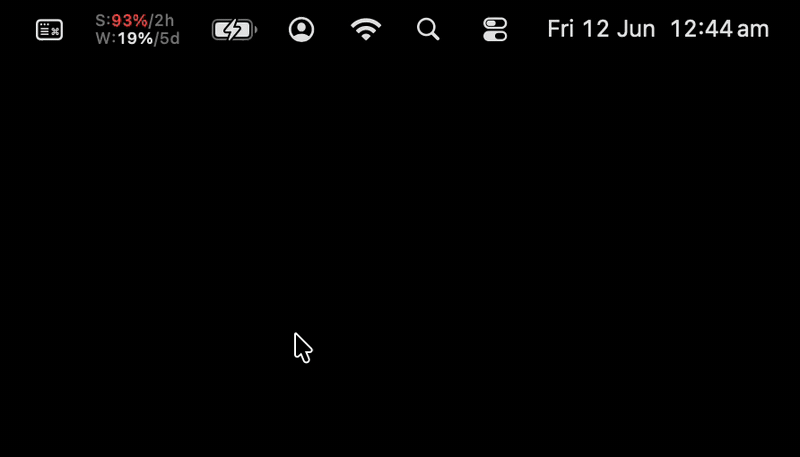

<p align="center">
  
</p>

**Claude Usage** is a macOS menu bar app for people running Claude Code on more than one subscription. Your 5-hour and weekly windows sit in the menu bar (`S:47%/3h` over `W:10%/5d` — used % and time to reset, exactly the statusline format). Click for both accounts' gauges; click the other account to switch the whole Mac to it. An optional autopilot switches for you when the active account runs hot.

```sh
git clone https://github.com/johnkueh/claude-usage-bar
cd claude-usage-bar && ./install.sh
```

Requires macOS 13+, `jq`, and the Xcode command line tools (`swiftc`) — the app builds from source on your machine in a few seconds, so there's no Gatekeeper dance and nothing to trust but the ~500 lines of Swift in `Sources/`.

## Capabilities

- **Statusline numbers, always visible.** 5-hour window on top, weekly below, with countdowns to reset. The percentage turns amber at 70%, red at 90%. A trailing `~` means the live fetch failed and you're seeing the last good numbers.
- **One-click account switching.** Each saved account is a menu row with its own usage gauges. Clicking the inactive one swaps the Claude Code keychain credential — new sessions and agents pick it up immediately; running sessions keep theirs. Switching is delegated to the bundled `claude-account` CLI, which re-snapshots the live credential first so refreshed tokens are never lost.
- **Autopilot (off by default).** When the active account's 5-hour window hits 90% (or weekly 99%) and another account has at least 15 points more usable headroom, it switches and posts a notification with the reason. It's reset-aware: if your 5-hour window resets within 20 minutes it rides it out instead of flipping, and in a near-tie it burns the account whose weekly window refreshes sooner. At most one auto-switch per hour.
- **Self-refreshing gauges.** An inactive account's access token expires roughly daily, which would otherwise leave its gauge stale until you switched to it. Instead, when a gauge goes stale the app renews that account's token in the background — it briefly loads the account's snapshot and runs a one-shot `claude -p` so Claude Code refreshes the token, then restores the account you were on. Debounced to at most once every 20 minutes per account, and a failed renewal never touches a good snapshot.
- **Accounts managed from the menu.** *Add Account…* snapshots whatever login Claude Code currently holds; the app also notices when the live login is one it doesn't recognize and offers to save it. *Remove* deletes the local snapshot only — the login itself is untouched.
- **Native everywhere.** A real `NSMenu` — system font, light/dark follows the OS, ⌘R refresh, ⌘Q quit. One small always-resident process; *Launch at Login* keeps it alive.

## How it works

Claude Code stores its login in the macOS keychain item `Claude Code-credentials`. The `claude-account` CLI snapshots that credential per account (`~/.claude/.cred-<name>`, chmod 600) and switching writes a snapshot back into the keychain — a real login, indistinguishable from `/login`.

The app reads on top of that:

1. Every 5 minutes (and on menu open, wake, and after a switch) it asks `api.anthropic.com/api/oauth/usage` for each account's windows — the active account's token via the keychain, the others from their snapshots. The read itself is read-only.
2. The menu bar item renders the active account; the menu shows everyone.
3. Switching shells out to `claude-account <name>` — the app adds zero credential logic of its own.
4. When an inactive account's token has expired (the read comes back unauthorized), the app shells out to `claude-account refresh <name>` to renew it, then re-reads. All credential logic stays in the CLI.

An inactive account's access token expires after a while. Rather than make you switch to it to wake it up, the app renews it for you (capability above) — `claude-account refresh` briefly swaps that account's snapshot into the keychain, lets a one-shot `claude -p` mint a fresh token via the refresh token, re-snapshots it, and restores the account you were on. The whole thing is lock-guarded and the keychain is swapped only for the few seconds `claude -p` runs.

## First-time setup

```sh
claude-account snapshot personal   # while logged into your first account
# /login as the second account in any Claude Code session, then:
claude-account snapshot work
open ~/Applications/"Claude Usage.app"
```

Names are yours to pick. Add a third account later and it just appears.

<details>
<summary><b>claude-account CLI reference</b></summary>

The app drives this; it also works standalone.

| Command | What it does |
|---|---|
| `claude-account snapshot <name>` | Save the currently-logged-in credential as `<name>` and mark it active. |
| `claude-account <name>` | Switch the Mac to `<name>` (re-snapshots the live credential first). |
| `claude-account status` | Which account is active + saved snapshots. |
| `claude-account whoami` | Resolve the live credential to an email via the OAuth profile endpoint. |
| `claude-account usage` | 5-hour + weekly utilization for every saved account, in the terminal. |
| `claude-account refresh [name…]` | Renew an inactive account's expired token without switching to it — loads its snapshot, runs a one-shot `claude -p` to mint a fresh token, restores the active account. Defaults to all inactive accounts. |

</details>

<details>
<summary><b>Debug hooks</b></summary>

| Env | What it does |
|---|---|
| `DEBUG_SHOOT=1` | Render the status item (dark + light) and menu rows to `/tmp/cub-*.png`, dump the menu structure to `/tmp/cub-menu.txt`, quit. |
| `DEBUG_SWITCH=<name>` | Exercise the switch path, then quit. |

</details>

## Notes

- Usage comes from the same OAuth endpoint Claude Code's own statusline uses; the percentages match what you see in-session.
- The keychain is read via `/usr/bin/security`, which your keychain already trusts for this item — the app never triggers its own access prompt.
- Switching mid-flight is safe by design: running sessions hold their credential; only new sessions and agents follow the Mac.
- The `claude agents` UI caches its account at startup and stamps it onto the agents it spawns, so a switch bounces that UI to pick up the new account — except when the UI is the parent of the session that ran the switch (then it just tells you to restart it), so a switch can never take down the session that issued it.

MIT.
